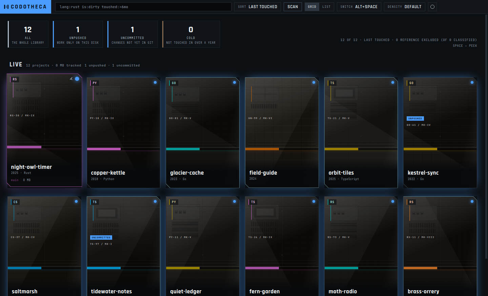
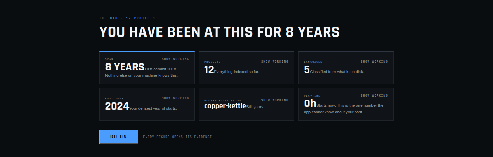
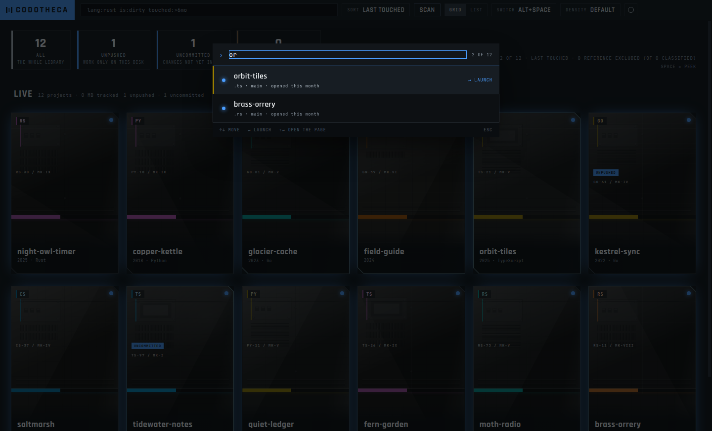
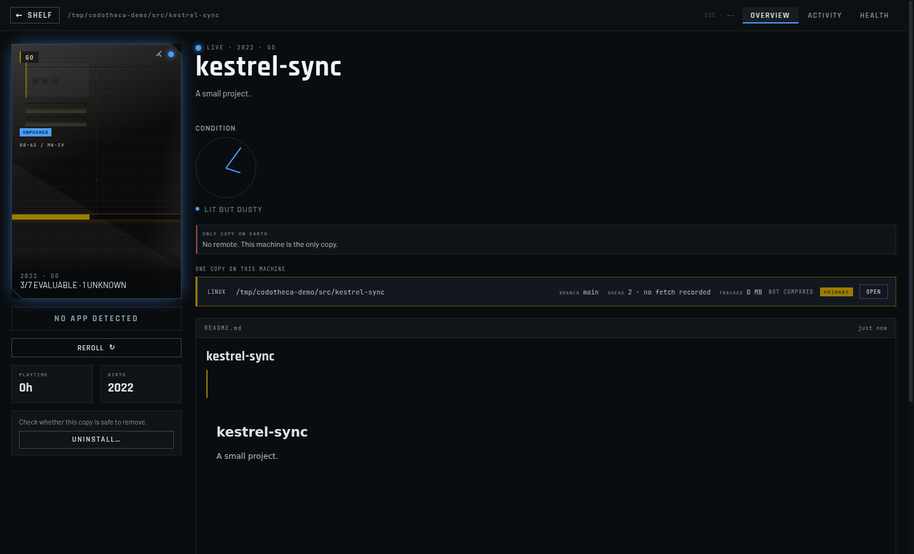
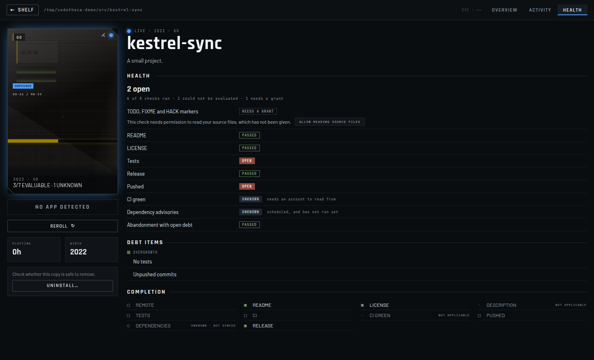

# Codotheca

A desktop library for the code you have written.

Every git repository you own becomes a tile with generated cover art, real status and a launch
button. It counts time the way a game launcher does, shows which projects are rotting, and adds a
light, ignorable layer that makes upkeep visible. Local-first, no account, no telemetry.

[](https://github.com/Wintersta7e/Codotheca/actions/workflows/ci.yml)




* * *

## Why

I have hundreds of repositories spread across two disks and a WSL distro, and I could not tell you
what is in most of them. Which ones still build. Which one I abandoned three weeks in. Which one has
uncommitted work I forgot about in 2023. `ls ~/code` is a list of names, and a name is not a memory.

Game launchers solved this — a shelf, cover art, a play button, hours played — and it works because
the shelf is *visual* and the state is *real*. Codotheca is that for the code you wrote. It scans
your disks, identifies each repository by its root commit, generates a piece of cover art seeded on
the project itself, and shows you what git actually says: dirty, ahead, shallow, stashed, untouched
since 2021.

The upkeep layer is deliberately quiet. A neglected project's cover art gathers dust, cobwebs and
rust drawn from what is actually wrong with it, and polishes back when you fix the thing. It does
not nag, it does not gamify, and it never invents a number it did not measure.

## Screenshots

| | |
|---|---|
|  |  |
|  |  |

Every repository in these screenshots is invented; they were taken from the real app.

## Status

**v1.0.0 — public beta.** Three of the six planned phases are complete — the shelf, remote
repositories with the quick-switch palette, and upkeep — and the app runs on Windows and Linux. It
is a personal tool built for one person's library; you are welcome to clone and build it, but there
is no adoption goal and no support guarantee.

### Implemented

- **Scanning** — walks your disks and WSL distros, classifies work trees, linked worktrees, separate
  git dirs, bare repos and submodules. Identity is the root-commit set, so a repository moved or
  cloned twice is still one project.
- **Cover art** — a machined-part scene document per project, rasterised by the Rust core to lossless
  WebP and seeded on the repository itself. The bitmap carries no text; type is DOM.
- **Real git state** — dirty, untracked, ahead/behind, stash, tags, shallow, interrupted merges and
  rebases, tracked bytes, commit-days. Never cached across a change it could not observe.
- **Launch and playtime** — a Play button that opens the project in your editor, with sessions
  counted the way a game launcher counts them.
- **The shelf** — era sections, a virtualised grid holding 60 fps at 1,000 cards, a list view, an
  attention row, and a query language: `is:dirty`, `is:shallow`, `has:readme`, `lang:rust`,
  `touched:<30d`, `in:wsl`, saved as collections.
- **Quick switch** — `Alt+Space` from anywhere, 9 ms to visible when the window is alive.
- **Project page** — overview, locations, README, a note, and an activity tab with two ledgers drawn
  side by side and never summed.
- **First run** — consent, root suggestion, a scan you can watch, and six reveal figures each
  carrying the coverage it was computed over.
- **GitHub, if you want it** — connect through GitHub's device flow, with the token kept in the OS
  keychain. Your own and your organisations' repositories join the shelf, matched to local copies
  by root commit; one you have not cloned shows as a blueprint tile. A `REMOTE` tab shows the
  forge's side of a project — CI runs, releases, and its README rendered in a sandbox, with remote
  images blocked per project until you allow them.
- **Install and Uninstall** — Install clones a blueprint into place. Uninstall removes a working
  copy only after a pre-flight proves nothing in it exists nowhere else, and is disabled, never
  confirmed through, when that is not proven. Git itself never removes anything: its only writes
  are `clone` and `fetch`, and `fetch` never prunes.
- **Health** — nine checks per project: a missing README, licence or tests, no release, unpushed
  commits, red CI, known-vulnerable dependencies, `TODO` markers in the source, and a project
  abandoned while it still carries debt. Each check can be switched off, and one that cannot see
  its evidence says so rather than reading as clean. Reading source for markers is a grant of its
  own. A `HEALTH` tab lists what is open.
- **Completion** — a ten-point checklist per project (remote, README, licence, description, tests,
  CI, CI green, pushed, dependencies, release). A check that does not fit the project is marked
  not applicable rather than failed: a documentation repository is not failed for having no tests.
- **Dependency advisories** — lockfiles in six formats, checked against GitHub's public advisory
  database. The lookup is unauthenticated and sends package names and versions, never source.
- **Condition** — five material layers on the cover art (dust, cobwebs, rust, cracks and
  overgrowth), each fed by the checks behind it, and a restoration surge when a fix lands. The
  shelf can sort by what needs attention; it is a sort, not a feed.
- **Packaging** — portable `.exe`, NSIS installer, AppImage, `.deb` and `.rpm`.

About 5,500 automated tests across the core, the shell and the renderer; eight Playwright tests that
launch the real Electron app, one of them asserting a painted screen; and an acceptance register
tying 737 checks to 320 written criteria.

### Known limits

- **The artifacts are unsigned.** Windows shows SmartScreen's *More info → Run anyway*. There is no
  certificate, by decision.
- **"Portable" means no installer, not portable data.** The portable `.exe` and the installed build
  share one per-user library, so two copies in two folders are not two libraries. It also unpacks
  ~377 MB into `%TEMP%`, cached across launches. `CODOTHECA_DATA_DIR` overrides the location.
- **No performance figures are published.** Every performance criterion is recorded as unmeasured
  rather than given a plausible budget, because a plausible number will be met. Real figures need
  hardware this has not been run on.
- **Linux GPU and compositor behaviour is tested on a single configuration.** The driver and
  compositor matrix is the main thing a beta is expected to surface.
- **Repositories inside WSL work through a second Linux binary** the Windows build carries. The path
  is tested on both sides but has not been driven end to end against a live distro.

### Not yet

- **Phase 4, motivation and the Amnesty** — rings, level, badges, recaps and quests, and the Amnesty:
  a safe way to retire a project, with its full recovery model. `push`, `checkout` and
  `worktree add` arrive with it, because that model is their undo.
- **Phase 5, the watchlist** — starred repositories as a wishlist, and a release feed.
- **Phase 6, polish** — cosmetics, custom art, a table view, and config sync.
- **Not in v1** — forges other than GitHub; and failing tests or compiler warnings as debt, because
  finding them means building or running your project, which Codotheca never does.

### Explicitly declined

- **No account, and no telemetry.** There is no Codotheca account and nothing reports on you. The
  network is reached for three things only: GitHub, once you connect it; the dependency-advisory
  lookup, covered by the file-reading consent on the first-run screen; and a README's remote
  images, per project, once you allow them.
- **No currency, ever.** If XP could buy anything, every honest XP source becomes a farm.
- **Not Tauri.** A system webview means Windows and Linux render through different engines, so a
  bug reproducible on one target need not exist on the other and CI cannot cover both.
- **Not libgit2.** Native `git` is shelled out to, config-neutralised, argv only, never a shell — CLI
  compatibility beats the process-spawn saving, and the performance answer is scheduling.
- **No canvas or WebGL.** Measured: pure DOM holds 60 fps at 1,000 virtualised cards, 4.2 ms p50.
- **macOS is deferred** until it can be tested on real hardware.

## Keyboard

| Key | Where | What |
|---|---|---|
| `Alt+Space` | anywhere | quick switch |
| `↑` `↓` `←` `→` | shelf | move the grid selection |
| `Enter` | shelf | launch the selected project |
| `Shift+Enter` | shelf | open the project page |
| `Space` | shelf | peek |
| `Escape` | shelf | close the peek |
| `P` | shelf | pin or unpin |
| `Ctrl+S` | shelf | save the current query as a collection |
| `←` `→` | project page | cycle tabs |
| `Escape` | project page | back to the shelf |
| `↑` `↓` | quick switch | move through the results |
| `Enter` | quick switch | launch the project |
| `Shift+Enter` | quick switch | open the project page |
| `Escape` | quick switch | close |
| `Escape` | settings | close the drawer |

Every context owns its keys exclusively and nothing is bound twice — `←` `→` move the grid on the
shelf and cycle tabs on the project page, and only one of those contexts is ever live.

## Quick start

Requires Rust (stable), Node `>=22.12.0`, and `git` 2.22 or newer on `PATH`.

On Linux the core also needs the D-Bus development headers, because the keychain reaches the
Secret Service over D-Bus. Without them the build fails inside a build script, naming
`libdbus-sys` rather than the package:

```sh
sudo apt-get install libdbus-1-dev pkg-config   # Debian and Ubuntu
sudo dnf install dbus-devel pkgconf-pkg-config  # Fedora
```

```sh
npm install              # workspace dependencies
npm run gen              # generate the protocol bindings for both languages
npm run build            # Rust core (release) + Electron bundles
npm run dev              # run the shell against the dev server
```

On a Windows filesystem — including a WSL checkout under `/mnt/c` — the install sequence is
different, and all three steps are required:

```sh
npm install --no-bin-links   # native modules break on a Windows mount without this
npm rebuild --ignore-scripts # --no-bin-links alone leaves node_modules/.bin empty
npm run prepare:win          # write the .cmd shims cmd.exe needs
```

Running the tests:

```sh
cargo test --manifest-path core/Cargo.toml --features testkit   # testkit is mandatory
npm run test --workspace app
npm run test --workspace protocol
npm run acceptance                                              # the criteria registry
cargo build --release --manifest-path core/Cargo.toml && npm run test:e2e --workspace app
```

`--features testkit` is not optional: the test seams sit behind a default-off feature, so a bare
`cargo test` skips every test that goes through them and still reports success. The end-to-end
tests launch the real app against a release core and skip without one, which is why the build
comes first.

Build artifacts land in `dist/`.

## Stack

| Layer | Choice | Why |
|---|---|---|
| Shell | Electron 44 | one engine on both targets, testable in CI |
| Renderer | React + electron-vite | DOM only in phase 1 |
| Core | Rust, supervised child process | owns the database, git and rasterisation |
| Transport | length-prefixed JSON on stdin/stdout | stdout carries frames and nothing else |
| Database | SQLite via rusqlite, WAL | exactly one writer, and it is the core |
| Git | native `git`, shelled out | CLI compatibility over a process-spawn saving |
| Contract | `protocol/schema/protocol.json` → codegen | one source of truth, both languages generated |

The renderer is sandboxed and cannot open the database. Every read crosses the protocol.

## Layout

```
core/       Rust core — scan, git, identity, jobs, art, SQLite. Runs as a child process
app/        Electron main process, preload, and the React renderer
protocol/   The core↔shell contract and its code generators
scripts/    Build, lint and release helpers
acceptance/ The criteria registry and its executable gates
docs/       Release checklist, WSL worker notes
```

## Design principles

1. **Never render unknown as zero.** No tick row means "not computed"; ten dark ticks mean "0 of 10".
2. **Never claim currency you do not have.** Absence of dirty is "no changes as of T", never "clean".
3. **Two ledgers, never merged.** Git facts recompute from history; playtime counts launched
   sessions. Side by side, never summed — a stacked bar reads as a total, and the total is undefined.
4. **Never reward volume.** No figure for lines written or commits made. The activity view counts
   commit-*days*.
5. **The renderer may never originate a filesystem path or an executable.** Paths enter only through
   a native dialog the shell owns.

## Documentation

- [`SECURITY.md`](SECURITY.md) — reporting a vulnerability
- [`docs/release-checklist.md`](docs/release-checklist.md) — what has to be true before a release
- [`docs/wsl-worker.md`](docs/wsl-worker.md) — the Linux worker Windows builds carry, for
  repositories that live inside WSL

## Licence

GPL-3.0-or-later. See [`LICENSE`](LICENSE). The bundled typefaces ship with their own OFL licences
under `licenses/fonts/`.

* * *

Built for one library, in the open. If it is useful to yours, good — but the shelf it was designed
against is mine, and the defaults show it.
